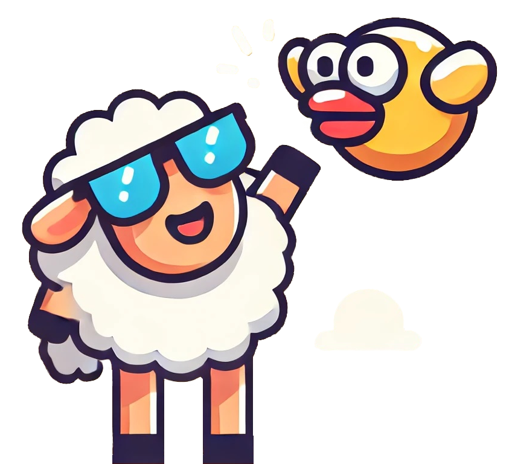
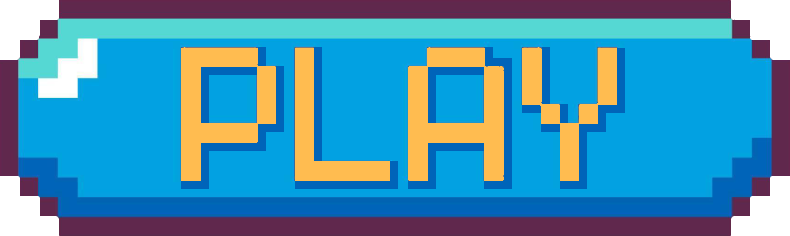

<!-- PROJECT SHIELDS -->

  <a href="">[![Contributors][contributors-shield]][contributors-url]</a>
  <a href="">[![Forks][forks-shield]][forks-url]</a>
  <a href="">[![Stargazers][stars-shield]][stars-url]</a>
  <a href="">[![Issues][issues-shield]][issues-url]</a>
  <a href="">[![MIT License][license-shield]][license-url]</a>
  <a href="">[![LinkedIn][linkedin-shield]][linkedin-url]</a>

<!-- PROJECT LOGO -->
 

  
   
  

ㅤ

<!-- ABOUT THE PROJECT -->
## Hey there! 😃
#### Thanks for checking out my SDL study project! 👍
#### I chose Flappy Bird game because it is simple, but still has interesting features like gravity, collision and spawnnig. And also because it's a fun game if the developer balance the values carefully.
#### In the making of this game, I was able to learn the basics of SDL (window management, event polling, rendering), improve my C++ knowledge and learn more about project tools like Premake and Emscripten.

## Built With:
* C++
* SDL2
* Visual Studio
#### Libraries:
* SDL_Image (load images)
* SDL_TTF (load fonts)
* ImGui (render UI)
#### Tools:
* Premake (generate project files for Visual Studio)
* Emscripten (generate web build)

 

<!-- LICENSE -->
## License

Distributed under the MIT License. See `LICENSE` for more information.

 

<!-- CONTACT -->
## Contact

Matheus Cordeiro - #kordeyrow (discord) - kordeyrow@gmail.com

 

<!-- ACKNOWLEDGMENTS -->
## Acknowledgments

* [Best README Template (Github)](https://github.com/othneildrew/Best-README-Template/tree/main?tab=readme-ov-file)
* [The Cherno (Youtube)](https://www.youtube.com/@TheCherno)
* [libsdl.org](https://www.libsdl.org/)
* [thenumb.at/cpp-course](https://thenumb.at/cpp-course/index.html#sdl)

<!-- MARKDOWN LINKS & IMAGES -->
<!-- https://www.markdownguide.org/basic-syntax/#reference-style-links -->
[contributors-shield]: https://img.shields.io/github/contributors/kordeyrow/flappy-bird-sdl.svg?style=for-the-badge
[contributors-url]: https://github.com/kordeyrow/flappy-bird-sdl/graphs/contributors
[forks-shield]: https://img.shields.io/github/forks/kordeyrow/flappy-bird-sdl.svg?style=for-the-badge
[forks-url]: https://github.com/kordeyrow/flappy-bird-sdl/network/members
[stars-shield]: https://img.shields.io/github/stars/kordeyrow/flappy-bird-sdl.svg?style=for-the-badge
[stars-url]: https://github.com/kordeyrow/flappy-bird-sdl/stargazers
[issues-shield]: https://img.shields.io/github/issues/kordeyrow/flappy-bird-sdl.svg?style=for-the-badge
[issues-url]: https://github.com/kordeyrow/flappy-bird-sdl/issues
[license-shield]: https://img.shields.io/github/license/kordeyrow/flappy-bird-sdl.svg?style=for-the-badge
[license-url]: https://github.com/kordeyrow/flappy-bird-sdl/blob/master/LICENSE
[linkedin-shield]: https://img.shields.io/badge/-LinkedIn-black.svg?style=for-the-badge&logo=linkedin&colorB=555
[linkedin-url]: https://www.linkedin.com/in/matheus-cordeiro-023025158/